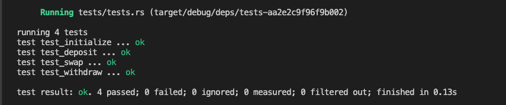

# amm-video

`amm-video` is an Anchor program for a two-token constant-product automated market maker (AMM).
Liquidity providers deposit X and Y tokens to receive LP tokens; burning LP tokens withdraws liquidity. Traders swap X for Y or Y for X with a minimum-output limit.

## Tasks completed

### 1. AMM program

The program exposes four instructions in [`programs/amm-video/src/lib.rs`](programs/amm-video/src/lib.rs):

| Instruction | Purpose |
| --- | --- |
| `initialize(seed, fee, authority)` | Creates the config, LP mint, and X/Y vault ATAs. Task 2 extends it with treasury ATAs. |
| `deposit(amount, max_x, max_y)` | Transfers liquidity into vaults and mints LP tokens; maximums enforce slippage protection. |
| `withdraw(amount, min_x, min_y)` | Burns LP tokens and returns computed liquidity; minimums enforce slippage protection. |
| `swap(is_x, amount_in, min_amount_out)` | Swaps X for Y when `is_x` is true, otherwise Y for X. |

Pool addresses are derived deterministically:

```text
config = PDA(["config", seed])
lp_mint = PDA(["lp", config])
vault_x = ATA(mint_x, config)
vault_y = ATA(mint_y, config)
```

`Config` stores mints, fee, authority, lock state, and PDA bumps. Task 1 keeps
the original instruction names, arguments, and AMM flow intact. No additional
administration instruction was added.

### 2. Fees and treasury account

The initialization fee is expressed in basis points; `30` means 0.30%. The
only program-account extension for Task 2 is a pool treasury PDA and its
canonical token accounts:

```text
treasury = PDA(["treasury", config])
treasury_x = ATA(mint_x, treasury)
treasury_y = ATA(mint_y, treasury)
```

For every swap, the curve supplies gross input, output, and fee. The program
sends net input (`amount_in - fee`) to the appropriate pool vault and sends the
fee to the corresponding treasury ATA. X-to-Y fees accumulate in `treasury_x`;
Y-to-X fees accumulate in `treasury_y`. Account constraints prevent callers
from redirecting this fee. There is intentionally no treasury withdrawal
instruction in this minimal implementation.

### 3. Tests for all instructions

The Rust LiteSVM suite is [`programs/amm-video/tests/tests.rs`](programs/amm-video/tests/tests.rs). Each test starts with new mints and a new pool.

| Test | Assertions |
| --- | --- |
| `test_initialize` | Config fields, LP supply, empty vaults, and empty treasuries. |
| `test_deposit` | Vault balances, user X/Y and LP balances, and LP supply. |
| `test_withdraw` | Vault and user balances after the LP burn, and reduced LP supply. |
| `test_swap` | Net input reaches the vault, output reaches the trader, and fees reach treasury. |

The swap fixture verifies that a 10,000,000-unit input at 30 bps transfers 30,000 units to `treasury_x`. The withdrawal fixture deliberately asserts the curve crate's precision-6 fixed-point rounding result of 33,333,334 units per asset.


### Tests screenshot
